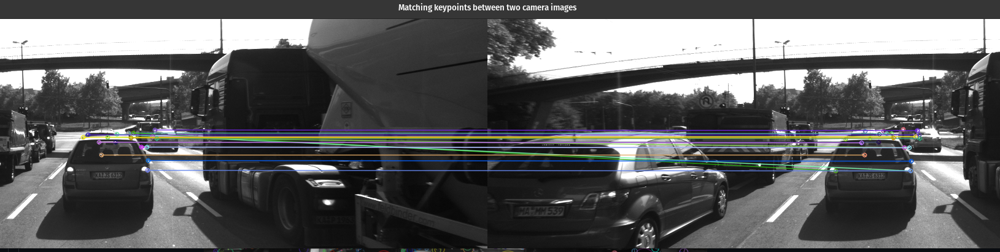

# 2D Feature Tracking

The idea of the repository is to build a collision detection system - that's a part of the 3d object tracking and time to collision project by fusing ldiar and camerra data. As a preparation for this, a build for feature tracking part and test various detector / descriptor combinations is made to see which ones perform best. This project consists of four parts:

* First, we focus on loading images, setting up data structures and putting everything into a ring buffer to optimize memory load. 
* Then, we integrate several keypoint detectors such as HARRIS, FAST, BRISK and SIFT and compare them with regard to number of keypoints and speed. 
* In the next part, we then focus on descriptor extraction and matching using brute force and also the FLANN approach we discussed in the previous lesson. 
* In the last part, once the code framework is complete, we test the various algorithms in different combinations and compare them with regard to some performance measures. 

## Basic Build Instructions

1. Clone this repo.
2. Make a build directory in the top level directory: `mkdir build && cd build`
3. Compile: `cmake .. && make`
4. Run it: `./2D_feature_tracking`.
